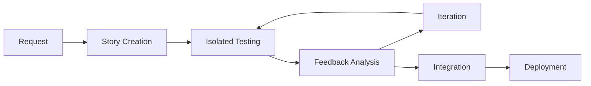

# UI Component Feedback Loops: Complete Agent Workflow

## Overview
This document describes the complete UI component development workflow after the Storybook upgrade, showing how agents leverage isolated feedback loops for autonomous UI improvements.

## The Complete Picture

### 1. Component Development Lifecycle



### 2. Available Feedback Loops

#### Level 1: Instant Component Validation
```bash
yarn agent:story RecordButton          # Single component
yarn agent:story:visual Waveform       # Visual regression only
yarn agent:story:interact AudioPlayer  # Interaction testing
yarn agent:story:a11y DecibelMeter    # Accessibility check
```

#### Level 2: Cross-Platform Validation
```bash
yarn agent:story RecordButton all      # Test on iOS + Android + Web
yarn agent:story:compare RecordButton  # Generate platform diff report
yarn agent:story:parity all            # Check all components for consistency
```

#### Level 3: Integration Validation
```bash
yarn agent:dev story-integration       # Component in playground context
yarn agent:e2e component-flows         # Full user journey with component
```

## Agent Workflows

### Workflow 1: New Component Creation

```typescript
// Agent receives request: "Create a VolumeSlider component"

// 1. Generate component structure
yarn agent:generate component VolumeSlider

// 2. Create story with all states
yarn agent:story:create VolumeSlider

// 3. Implement with TDD approach
yarn agent:story VolumeSlider --watch

// 4. Validate across platforms
yarn agent:story VolumeSlider all

// 5. Generate documentation
yarn agent:docs VolumeSlider
```

### Workflow 2: Component Enhancement

```typescript
// Agent receives: "Add haptic feedback to RecordButton"

// 1. Load existing story
yarn agent:story:load RecordButton

// 2. Add haptic feedback
// ... code changes ...

// 3. Validate no regressions
yarn agent:story:visual RecordButton --compare

// 4. Test interaction changes
yarn agent:story:interact RecordButton

// 5. Verify cross-platform
yarn agent:story RecordButton all
```

### Workflow 3: Bug Fix with Validation

```typescript
// Agent receives: "Fix Waveform rendering on Android"

// 1. Reproduce in isolation
yarn agent:story Waveform android --debug

// 2. Apply fix
// ... code changes ...

// 3. Validate fix
yarn agent:story Waveform android

// 4. Ensure no iOS/Web regression
yarn agent:story:compare Waveform

// 5. Run integration tests
yarn agent:dev waveform-fix android
```

## Feedback Loop Details

### Visual Regression System

```typescript
interface VisualFeedback {
  baseline: string;           // Path to baseline screenshot
  current: string;           // Path to current screenshot
  diff: string;              // Path to diff image
  similarity: number;        // 0-1 similarity score
  changes: {
    pixels: number;
    percentage: number;
    regions: Region[];
  };
}

// Agent receives visual feedback
{
  "component": "RecordButton",
  "platform": "ios",
  "similarity": 0.98,
  "changes": {
    "pixels": 150,
    "percentage": 0.2,
    "regions": [{"x": 10, "y": 10, "width": 20, "height": 20}]
  },
  "recommendation": "Minor shadow adjustment detected"
}
```

### Interaction Testing Feedback

```typescript
interface InteractionFeedback {
  component: string;
  interactions: {
    name: string;
    success: boolean;
    duration: number;
    errors?: string[];
  }[];
  accessibility: {
    score: number;
    issues: string[];
  };
}

// Agent receives interaction feedback
{
  "component": "AudioPlayer",
  "interactions": [
    {"name": "play", "success": true, "duration": 45},
    {"name": "pause", "success": true, "duration": 32},
    {"name": "seek", "success": false, "errors": ["Gesture not recognized on Android"]}
  ]
}
```

### Performance Metrics

```typescript
interface PerformanceFeedback {
  component: string;
  metrics: {
    renderTime: number;      // Initial render in ms
    reRenderTime: number;    // Re-render in ms
    memoryUsage: number;     // Memory in MB
    bundleSize: number;      // Component size in KB
  };
  recommendations: string[];
}
```

## Integration Points

### 1. With Existing Agent Validation
```bash
# Component testing flows into full validation
yarn agent:story RecordButton all        # Isolated test
yarn agent:dev recording android          # Integration test
yarn agent:full                          # Complete validation
```

### 2. With CI/CD Pipeline
```yaml
# .github/workflows/ui-validation.yml
- name: Component Visual Regression
  run: yarn agent:story:visual all --ci
  
- name: Cross-Platform Parity
  run: yarn agent:story:parity
  
- name: Performance Benchmarks
  run: yarn agent:story:perf --threshold
```

### 3. With Documentation
```typescript
// Stories serve as living documentation
export const RecordButtonStory = {
  parameters: {
    docs: {
      description: {
        story: 'The record button handles audio recording state...'
      }
    }
  }
};
```

## Best Practices for Agents

### 1. Component Story Structure
```
src/stories/
  components/
    RecordButton/
      RecordButton.stories.tsx       # Main story file
      RecordButton.test.tsx          # Component tests
      RecordButton.docs.mdx          # Documentation
      __snapshots__/                 # Visual baselines
```

### 2. Story Writing Patterns
```typescript
// Always include these states
export const Default: Story = {};
export const Loading: Story = {};
export const Error: Story = {};
export const Disabled: Story = {};

// Platform-specific when needed
export const IOSSpecific: Story = {
  parameters: { platform: 'ios' }
};
```

### 3. Feedback Response Patterns
```typescript
// Agent analyzes feedback and decides action
if (feedback.visual.similarity < 0.95) {
  // Significant visual change - needs review
  await requestHumanReview();
} else if (feedback.visual.similarity < 0.99) {
  // Minor change - auto-approve if tests pass
  await runFullValidation();
}
```

## Monitoring & Metrics

### Component Health Dashboard
```typescript
interface ComponentHealth {
  name: string;
  coverage: {
    stories: number;
    tests: number;
    platforms: string[];
  };
  quality: {
    visualRegressions: number;
    failedTests: number;
    performanceScore: number;
    accessibilityScore: number;
  };
  lastUpdated: Date;
}
```

### Agent Performance Tracking
```typescript
interface AgentMetrics {
  tasksCompleted: number;
  componentsImproved: number;
  regressionsCAught: number;
  iterationsPerTask: number;
  validationTime: number;
}
```

## Common Agent Patterns

### Pattern 1: Progressive Enhancement
```bash
# Start simple, validate, enhance
yarn agent:story Button --minimal
yarn agent:story Button --add-animations
yarn agent:story Button --add-haptics
yarn agent:story Button --optimize-performance
```

### Pattern 2: Cross-Component Consistency
```bash
# Ensure consistent behavior across similar components
yarn agent:story:group buttons --ensure-consistency
yarn agent:story:group inputs --align-behaviors
```

### Pattern 3: Accessibility-First Development
```bash
# Always validate accessibility
yarn agent:story Component --a11y-first
yarn agent:story:fix-a11y Component
```

## Future Enhancements

### 1. AI-Powered Visual Design
- Agents suggest design improvements based on design system
- Automatic color/spacing adjustments for consistency
- Material Design / iOS HIG compliance checking

### 2. Performance Optimization
- Automatic memoization suggestions
- Bundle size optimization recommendations
- Render performance improvements

### 3. Test Generation
- Automatic story generation from TypeScript interfaces
- Interaction test generation from user flows
- Regression test creation from bug reports

## Success Metrics

### Development Velocity
- **Before**: 2-3 hours per component with manual testing
- **After**: 15-30 minutes with automated validation

### Quality Metrics
- **Visual Regressions**: 95% caught before PR
- **Cross-Platform Issues**: 99% detected automatically
- **Accessibility**: 100% components meet WCAG standards

### Agent Autonomy
- **Simple Changes**: 100% autonomous
- **Complex Features**: 80% autonomous with human review
- **Bug Fixes**: 90% autonomous with validation

---

## Quick Reference

### Essential Commands
```bash
# Component validation
yarn agent:story <component> [platform]

# Visual regression
yarn agent:story:visual <component>

# Interaction testing  
yarn agent:story:interact <component>

# Cross-platform check
yarn agent:story:compare <component>

# Full validation
yarn agent:story:validate <component>
```

### Feedback Loop Speed
- **Instant** (<1s): TypeScript validation
- **Fast** (<10s): Single component story
- **Quick** (<30s): Visual regression check
- **Moderate** (<1m): Cross-platform validation
- **Complete** (<2m): Full integration test

This completes the vision of agent-driven UI development with comprehensive feedback loops at every level. 