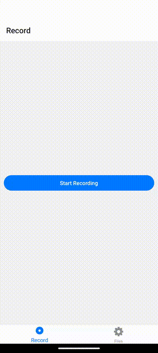

# @siteed/expo-audio-ui

[](https://www.npmjs.com/package/@siteed/expo-audio-ui)
[](https://www.npmjs.com/package/@siteed/expo-audio-ui)
[](https://github.com/deeeed/audiolab)

**Give it a GitHub star, if you found this repo useful.**

Audio visualization and control components for React Native, built with Skia and Reanimated. Designed to work with [@siteed/audio-studio](https://github.com/deeeed/audiolab/tree/main/packages/audio-studio).

<div align="center">
  <a href="https://deeeed.github.io/audiolab/playground/">
    
  </a>
  <p><a href="https://deeeed.github.io/audiolab/expo-audio-ui-storybook">Storybook</a></p>
</div>

## Components

- **AudioVisualizer** — interactive waveform with navigation, amplitude scaling, and theming
- **DecibelGauge** — gauge display for audio levels in dB
- **DecibelMeter** — linear meter with customizable thresholds
- **RecordButton** — recording button with visual feedback and animations
- **Waveform** — lightweight waveform renderer
- **AudioTimeRangeSelector** — interactive time range selection with drag handles
- **MelSpectrogramVisualizer** — real-time mel spectrogram display

## Install

```bash
yarn add @siteed/expo-audio-ui
```

Peer dependencies:

```bash
yarn add @shopify/react-native-skia react-native-gesture-handler react-native-reanimated
```

## Development

```bash
cd packages/audio-ui
yarn storybook
# Opens at http://localhost:6068
```

## Docs

- [Getting Started Guide](https://deeeed.github.io/audiolab/docs/)
- [Storybook](https://deeeed.github.io/audiolab/expo-audio-ui-storybook)

## License

MIT — see [LICENSE](LICENSE).

---
<sub>Created by [Arthur Breton](https://siteed.net)</sub>
