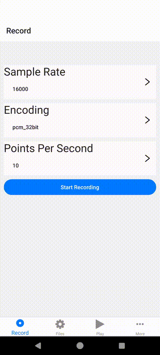

# @siteed/expo-audio-stream

  <h2 align="center">
     
    <strong>Comprehensive library designed to facilitate real-time audio processing and streaming across iOS, Android, and web platforms.
     
     
    
  </h2>

**Give it a GitHub star 🌟, if you found this repo useful.**

## Features

- Real-time audio streaming across iOS, Android, and web.
- Configurable intervals for audio buffer receipt.
- Automated microphone permissions setup in managed Expo projects.
- Background audio recording on iOS.
- Audio features extraction during recording.
- Consistent WAV PCM recording format across all platforms.

## Documentation

For detailed documentation, please refer to the [Getting Started Guide](https://deeeed.github.io/expo-audio-stream/docs/).

