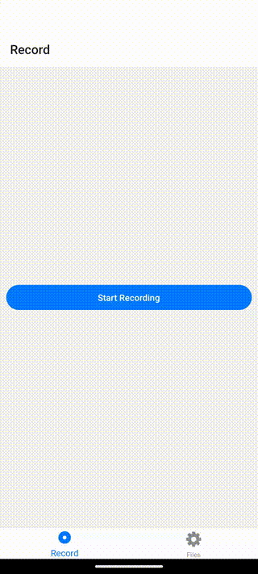

<div align="center">
  <h1 align="center">
    @siteed/expo-audio-stream-ui
  </h1>
  <p>
  <strong>@siteed/expo-audio-stream-ui<strong> is a UI component library designed to complement the @siteed/expo-audio-stream library for real-time audio processing and streaming.
  </p>
  <div align="center">
    <b>Storybook</b>
    <p><a href="https://deeeed.github.io/expo-audio-stream/expo-audio-ui-storybook">https://deeeed.github.io/expo-audio-stream/expo-audio-ui-storybook</a></p>
  </div>
  <a href="https://deeeed.github.io/expo-audio-stream/playground/">
    
  </a>
</div>

## Features

- Customizable UI components for real-time audio streaming.
- Intuitive interfaces for audio controls and visualizations.
- Seamless integration with @siteed/expo-audio-stream.
- Support for iOS, Android, and web platforms.

## Currently Available Components

- **AudioVisualizer**: A powerful component for visualizing audio waveforms with extensive customization options, including interactive navigation, amplitude scaling, and theming.
- **DecibelGauge**: A gauge component for displaying audio levels in decibels with various formatting options and customizable appearance.

## Installation

```bash
# Install the UI components package
npm install @siteed/expo-audio-ui

# or with yarn
yarn add @siteed/expo-audio-ui
```

Make sure you have the required peer dependencies installed:

```bash
npm install @shopify/react-native-skia react-native-gesture-handler react-native-reanimated
```

## Development Status

This package is currently under active development and is primarily used for testing purposes. The API and features are subject to change. Future updates will focus on optimization and expanding the component library with additional audio visualization and control components.

## Documentation

For detailed documentation and usage instructions, please refer to the [Getting Started Guide](https://deeeed.github.io/expo-audio-stream/docs/).

## License

This project is licensed under the MIT License - see the [LICENSE](LICENSE) file for details.

---
<sub>Created by [Arthur Breton](https://siteed.net) • See more projects at [siteed.net](https://siteed.net)</sub>
